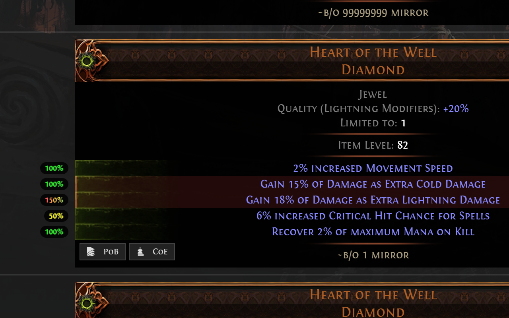
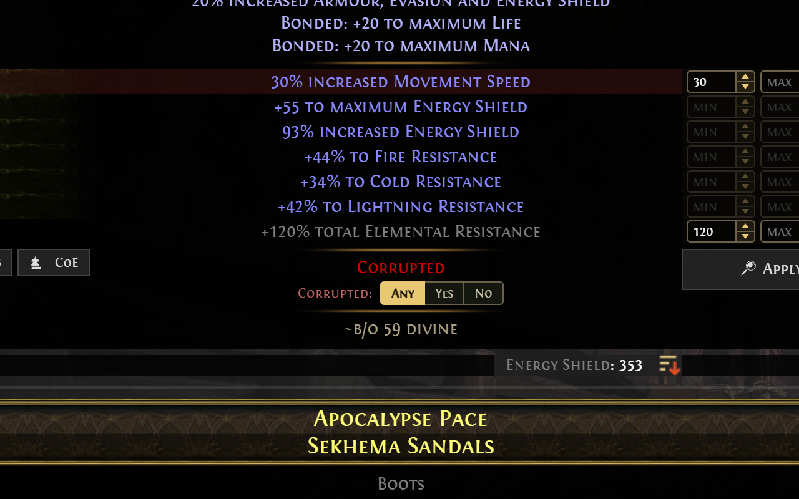
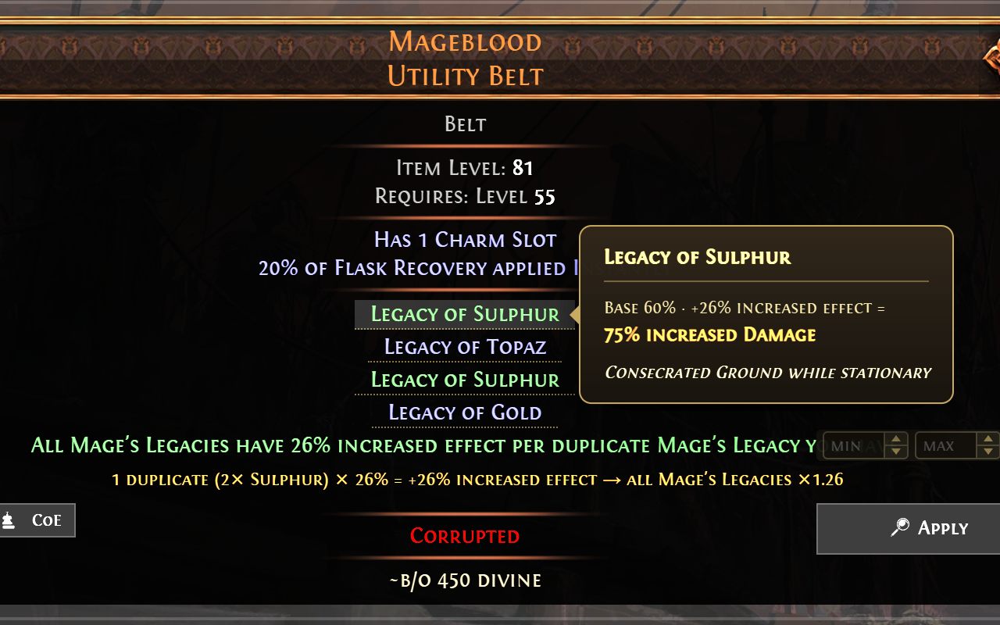
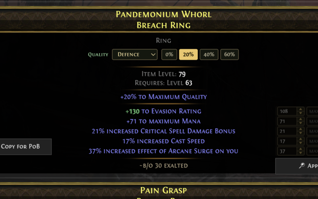
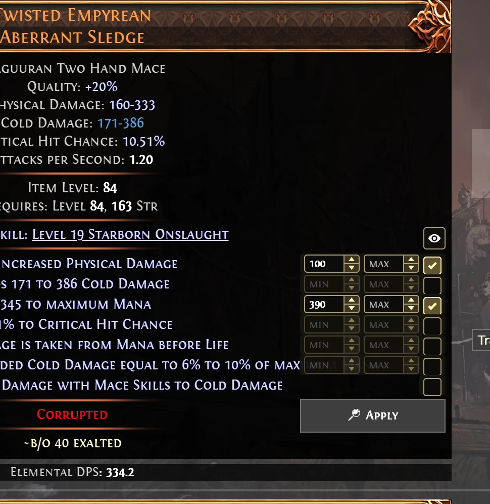
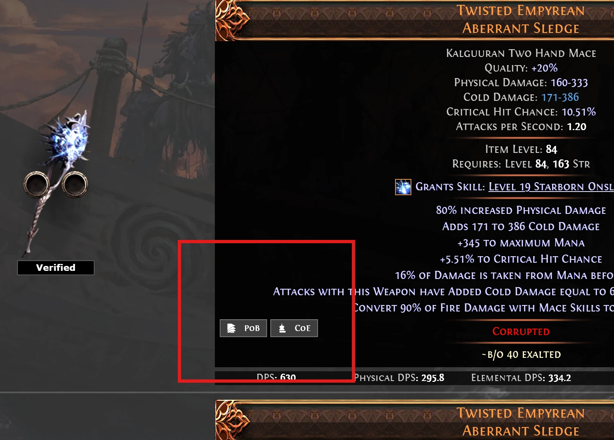
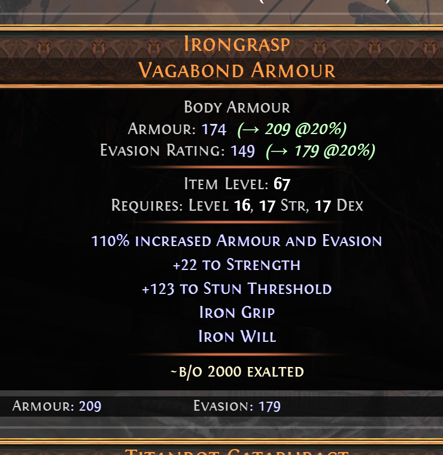

# Wraeclast Market

A browser extension that enhances the pathofexile.com trade site experience for Path of Exile and Path of Exile 2. (Based on the [Better Trading](https://github.com/exile-center/better-trading) extension.)

## Features

- Works on both **Path of Exile** and **Path of Exile 2** trade sites
- **Apply stat filters from results** — inline min/max inputs + one-click Apply that re-runs your search in place (no page reload, so it's fast and light on the trade site's rate limits); untick a mod to drop its filter
- **Copy for PoB** — one-click export an item to import into Path of Building
- **Copy for CoE** — one-click export an item to import into [Craft of Exile](https://www.craftofexile.com/) (PoE 2)
- **Roll quality %** — each rolled prefix/suffix shows how high it rolled within its tier range, as a colour-graded pill beside the item (**red → green**; **rainbow** for corrupted over-rolls). Network-free — read straight from the trade card
- **Corrupted quick-filter** — corrupted items get a 3-state **Any / Yes / No** toggle below the Corrupted line that sets the search's *Corrupted* (or *Twice Corrupted*) filter and re-runs in place
- **Quality simulator** (PoE 1 & 2) — preview how catalyst quality scales ring & amulet mods, live (PoE 2 Breach catalysts up to 40/60%; PoE 1 catalysts up to 20%); hidden on corrupted items (quality is locked)
- **Mageblood Legacy effects** (PoE 2) — hover a **Legacy of X** to reveal its effect (the card only shows the name), with the "increased effect per duplicate" maths worked out (base → +N% increased effect → final, applied to every Legacy), matching Path of Building; the duplicate-maths summary stays visible and duplicated Legacies are highlighted green
- Equivalent pricing across currencies (powered by [poe.ninja](https://poe.ninja/)) — PoE 1 prices shown in Divine & Chaos
- Bookmarks manager — organize searches into folders with class / currency icons
- Pin items (with quick-jump) & search history
- Searched mods highlighting
- Regroup similar results
- Warning for armours that cannot be 6-socketed (PoE 1 only)
- ... more to come !

## Screenshots

|  |  |
| --- | --- |
| **Roll quality %**  | **Corrupted quick-filter**  |
| **Mageblood Legacy effects**  | **Quality simulator**  |
| **Apply stat filters from results**  | **Copy for PoB / CoE**  |
| **Quality projection (20%)**  |  |

## Contributing

1. Make sure Node.js (18+) and NPM (8+) are installed (the build runs on Node 24 via `NODE_OPTIONS=--openssl-legacy-provider`);
2. Install the dependencies with `make dependencies`;
3. Build the project with `make dev`;
4. Install the local extension located at `./dist/dev`.

The command `make package` can be used to generated the store-ready zip files (chrome and firefox).

Don't forget to run `make help` to know more about the other commands.

**Useful resources**

- [How to install a local extension](https://developer.chrome.com/extensions/getstarted)
- [Extension reloader](https://chrome.google.com/webstore/detail/extensions-reloader/fimgfedafeadlieiabdeeaodndnlbhid)

## Credits

- Button icons (**papers** on "Copy for PoB", **magnifying-glass** on "Apply") by [Lorc](https://lorcblog.blogspot.com/) from [game-icons.net](https://game-icons.net/), licensed under [CC BY 3.0](https://creativecommons.org/licenses/by/3.0/).
